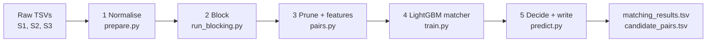

# Amazon ML Challenge — Business Entity Resolution: Status & Cloud Runbook

As of 2026-09-25

## Summary

The pipeline works end-to-end on a 10% development subset and scores **0.9885 macro F0.5** on held-out Source-1 entities. What remains is the full-scale run (train 12.5M records, test 11.7M records), which exceeds the laptop's 15.6 GB RAM and will move to an AWS EC2 machine.

The task: for every Source-1 business record, list every Source-2/Source-3 record that refers to the same business. Scoring is F0.5 per Source-1 entity, averaged, so precision counts twice as much as recall and correctly predicting "no match" earns full credit.

| Stage | State |
| --- | --- |
| Data study (train + test incl. France) | Done |
| Normalisation of all 24.2M records, incl. learned Indic-script transliteration | Done, cached as parquet (2.8 GB) |
| Blocking (candidate generation) | Designed and validated on 10% subset: 98.7% pair recall at 3.3 candidates per record |
| Pair features + LightGBM matcher + decision rule | Validated on 10% subset: 0.9885 macro F0.5 |
| Full-scale train blocking, features, training | Not started: blocked by laptop RAM/disk, moving to AWS |
| Test inference and submission files | Not started |
| Submission zip (code, README, requirements, methodology) | Not started |

## Data findings

The data is large and synthetic: a generator applied known noise patterns to real-looking businesses, so modelling those patterns directly pays off.

| Split | Source 1 | Source 2 | Source 3 | Countries |
| --- | --- | --- | --- | --- |
| Train | 2,206,821 | 5,034,616 | 5,285,603 | US, India |
| Test | 1,732,544 | 4,887,273 | 5,082,316 | US, India, France (259k S1) |

**Match structure (train)**

- 7,638,365 true pairs; a Source-1 entity has 3.46 matches on average (0 to 11).
- 5.6% of Source-1 entities are singletons (no match), the same rate in US and India.
- Every Source-2/3 record matches **at most one** Source-1 entity. This makes the target record the natural unit: pick its single best Source-1 entity or none.
- 26% of Source-2/3 records match nothing (distractors).
- A true match never crosses country labels, so country is a safe hard block (kept as an open string set so France works unchanged).

**Name noise**: case changes, doubled spaces, OCR swaps (l/I/1, 0/O, 5/S), injected accents, duplicated or dropped tokens, shuffled word order, legal-form variants (`[LLC]`, `(L.L.C.)`, `Pvt.`, `Límited`), junk prefixes (`The`, `Dr`, `Sri`, `M/s`, `...`, `***`, `>>`), filler suffixes (`Center`, `Services`), domain forms (`soclaronflex.com`, `#whestate`), DBA connectors (`X trading as Y`, `F/K/A`, `a/k/a`), full rebrands (`Arialyra`) matchable only by address.

**Indic scripts**: 18% of India Source-2/3 names are in Devanagari, Bengali, Telugu, Kannada, Tamil, Gujarati, Malayalam, Gurmukhi or Oriya, and state names in addresses often are too.

**Address noise**: uppercase, `#`/`##` prefixes, abbreviations (St/Street, and even Street→"Saint"), city typos (`GRAND RAIRIE`), reordered components, dropped house numbers or cities, altered house numbers, injected `Door No` numbers, `<NULL>`, alternative locality names; 3.3% of targets have an empty address.

**Hard negatives**: common names (`Helios`, `Apex`) appear hundreds of times as different businesses, and some distractors are near-copies of a real entity with a changed house number or legal form (`Holy Synagogue Inc, 220 Park St` vs Source-1 `2204 Park Street`).

**France (test only)**: generic names (`Club`, `Union`, `Ecole`), few cities, abbreviations `R.`, `AV.`, `ALL`, `Imp.`, départements in Source 2 vs regions in Source 1. No training data exists, so every feature is country-agnostic.

## Pipeline architecture

Five stages, each a script that caches its output so any stage can be rerun alone.

Each arrow is a parquet file in the work directory.

**1. Normalisation** (`normalize.py`, `translit.py`)

- Names: ASCII-fold, OCR repair inside words (`capita1`→`capital`, `lnc`→`inc`), dotted legal forms joined, legal words canonicalised, junk prefixes and repeated tokens removed, DBA/website parts split into an alternative name, domain names detected.
- Outputs per record: full name, core name (no legal words), alternative name, legal category, squashed name, acronym, consonant skeleton (`krishna` and romanised `kRssnn` both give `krsn`).
- Addresses: canonical short forms (`street/st/saint`→`st`), ordinals to digits, US/India state names to codes, leading zeros stripped; outputs token string, word string, number set, 6-digit PIN, house number.
- Indic scripts: a native→Latin token table (1,362 entries) mined from matched training pairs of the non-validation folds, plus a rule-based romaniser fallback.

**2. Blocking** (`blocking.py`): every record emits hashed keys: name tokens, skeletons, name-token pairs, name token × rare address word, house number × rare address word, rare address-word pairs, squashed/domain name. Keys shared by more than 300 Source-1 records in a country are dropped. A pair's score is the sum of IDF weights of its shared keys; each target keeps its top 10 Source-1 records.

**3. Pruning and features** (`pairs.py`, `features.py`): keep a candidate only if its blocking score is at least 25% of that target's best. About 140 features per pair:

- Name similarity: rapidfuzz ratio, token-set, sorted-token, Jaro-Winkler, Levenshtein, skeleton and squashed-name ratios, alternative-name cross match, acronym match, domain coverage, legal-category agreement.
- Address similarity: ratios, token-set, number Jaccard, conflicting numbers, house-number equality and prefix relation, PIN agreement, empty-address flags.
- IDF-weighted token overlap for names, skeletons and address words.
- Frequency: how many records in the country share this exact name or address (added after the error analysis, not yet measured).
- Context: rank and gap of this pair versus the other candidates of the same target and of the same Source-1 entity.
- Blocking score, rank and key-type counts.

**4. Matcher** (`model.py`, `train.py`): LightGBM binary classifier. Source-1 entities are split into 5 folds by a hash of their id; fold 0 never touches any fitted component.

**5. Decision** (`evaluate.py`): each target goes to its single highest-probability Source-1 entity, kept only if the probability is at least threshold t (tuned on fold 0; 0.80 on the dev subset). Source-1 entities with nothing kept get an empty list, which is how singletons earn their 1.0.

## Results so far

All numbers come from a development subset: 10% of train Source-1 entities (220,000), all their true targets, and 10% of unmatched targets, which is 1.25M records and 759,812 true pairs. Key-frequency caps were scaled to match full-scale density (max_df 30 on the subset equals 300 at full scale).

**Blocking recall** (share of true pairs whose Source-1 entity is among the target's top-K candidates), 38 seconds:

| K | 1 | 2 | 3 | 5 | 10 | 20 |
| --- | --- | --- | --- | --- | --- | --- |
| Recall | 96.33% | 97.27% | 97.68% | 98.20% | 98.71% | 98.95% |

Every key type contributes positives no other key finds: name-token pairs 5,814, rare address-word pairs 6,018, house number × street 5,406, squashed/domain name 3,485, name × address word 2,160, single name token 1,299, skeleton 25.

**Pruning** (label-free rule: keep a candidate if its blocking score is at least r × the target's best):

| Top-K | r | Pairs per target | Recall |
| --- | --- | --- | --- |
| 10 | 0.0 | 8.04 | 98.71% |
| 10 | 0.25 (chosen) | about 3.5 | 98.71% |
| 10 | 0.3 | 3.27 | 98.71% |
| 5 | 0.3 | 2.20 | 98.20% |
| 3 | 0.3 | 1.67 | 97.68% |

**Matcher baseline**: 3,553,890 pairs (750,021 positive), 123 features, LightGBM 600 rounds, trained on folds 1-4, scored on fold 0.

- **Validation macro F0.5 = 0.9885** at threshold 0.80; thresholds 0.75-0.80 all score 0.9885 ± 0.0001, so the choice is stable.
- On fold 0: 148,220 true positives, 321 false positives, 4,386 false negatives (1,971 of them never reached the candidate set).
- Strongest features by gain: gap to the target's next-best candidate on blocking score, number overlap and address token-set; then address token-set, name Jaro-Winkler, name-ratio gap, conflicting numbers.

**Error analysis**

- Most remaining misses are targets with an **empty address** and an exact name (`True Welfare Society Corp`, p = 0.49). The model cannot tell how unique the name is, hence the new frequency features.
- False positives are mostly near-copies: same street with house number off by a few (`834` vs `831 Suntree Drive`), or a different legal form (`Public Limited` vs `Private Limited`). Some true matches also carry altered numbers, so part of this is irreducible noise.
- About 45% of misses are blocking misses: typo in every name token plus a missing or garbled address (`Midwest Cobmttee`).

Caveat: the subset is one tenth as dense as the real data, so there are fewer look-alike businesses per record. Expect the full-scale score to be somewhat lower.

## Engineering lessons

The laptop (4 cores, 15.6 GB RAM, about 15 GB free disk at start) was the bottleneck, not the method.

| Problem | Cause | Fix |
| --- | --- | --- |
| Normalisation crashed (3.7 GB allocation failed) | Whole split in memory at once | Stream each source file in 1M-row chunks through a reused 4-process pool; 20 min per split |
| First blocking run took 57 min on the subset | Swapping to disk | Same code took 38 s once memory was free |
| Blocking key table would reach ~375M rows (~7 GB) | All keys built at once | Source-1 keys built in chunks, targets processed 250k at a time, blocking run one country at a time |
| Feature build 21 s per 100k pairs | Re-tokenising all records on each call; slow token-based rapidfuzz scorers | Work only on the chunk's records; precomputed sorted-token strings; dropped redundant scorers: 6.3 s per 100k |
| Everything 8-40× slower mid-session | Laptop on battery, CPU throttled to 898 MHz of 2995 MHz | Charger plugged in |
| Full-train blocking crashed; disk hit 0 bytes | Out of RAM with other apps open; Windows grew its pagefile to 20.5 GB | Deleted regenerable files and pip cache (1.65 GB free); decision to move full-scale runs to AWS |

**Timing reference** at full CPU speed: normalisation about 20 min per split; blocking about 40 s per 1.25M records on the subset; features about 6.3 s per 100k pairs (dev measured 22 s per 100k under partial throttling); LightGBM 600 rounds on 2.8M rows took 28 min on 4 cores.

**Rule for any machine**: run heavy stages one at a time, never in parallel.

## Code map

| File | Role | Output |
| --- | --- | --- |
| `config.py` | Paths from env vars, folds (5, validation fold 0), worker count | — |
| `io_utils.py` | Read TSVs literally (no quote parsing), load ground truth, write both submission files | — |
| `translit.py` | Learn native→Latin token table from training pairs; romaniser fallback | `translit.pkl` |
| `normalize.py` | Name and address normalisation, skeleton key, parallel frame API | — |
| `prepare.py` | Stage 1 driver | `{split}_recs.parquet` |
| `blocking.py` | Key generation and weighted key join | — |
| `run_blocking.py` | Stage 2 driver, per country; recall report on train | `{split}_cands.parquet` |
| `pairs.py` | Pruning rule, chunked feature build | `{split}_feat_NNN.parquet` |
| `features.py` | Pair features, IDF overlaps, frequency features, context features | — |
| `model.py` | S1-side context pass, LightGBM train/predict helpers | `{split}_ctxs.parquet` |
| `evaluate.py` | Exact macro F0.5, decision rule, threshold search | — |
| `train.py` | Stage 4 driver: features → model → fold-0 tuning | `model_stage1.txt`, `stage1.json` |
| `predict.py` | Stage 5 driver: test features → predictions → TSVs → official validator | `output/*.tsv` |

**Environment variables**: `ER_DATA_DIR` (folder holding `train/` and `test/`), `ER_WORK_DIR`, `ER_OUT_DIR`, `ER_WORKERS` (default 4).

**Dependencies**: Python 3.11, polars, pyarrow, numpy, rapidfuzz, unidecode, lightgbm. All MIT, BSD or Apache licensed; no pretrained model is used, so the ≤8B-parameter MIT/Apache model rule is met trivially.

## Remaining work: cloud runbook

The full-scale run moves to one AWS EC2 machine in Mumbai: `r6i.2xlarge` (8 vCPU, 64 GB RAM) with a 100 GB disk. Approximate cost: about $0.55 per hour for the machine, plus about $0.30 per day for the disk. A 4-6 hour run should use roughly $3-6 of the $200 credit.

### A. Account setup (about 5 minutes)

1. Sign in at console.aws.amazon.com with the AWS **account** (not the Builder ID) and check Billing → Credits shows the credit.
2. IAM → Users → Create user `er-hackathon` → attach `AmazonEC2FullAccess`.
3. That user → Security credentials → Create access key → "Command Line Interface".
4. In a terminal run `aws configure`: key ID and secret, region `ap-south-1`, output `json`. Never commit or share the secret.

### B. Machine launch (after cost approval)

1. Check the vCPU quota: `aws service-quotas get-service-quota --service-code ec2 --quota-code L-1216C47A`. New accounts may cap at fewer than 8 vCPU; the fallback is `r6i.xlarge` (4 vCPU, 32 GB).
2. Create an SSH key pair and a security group allowing SSH (port 22) from your current IP only.
3. Launch Ubuntu 24.04 on `r6i.2xlarge`, 100 GB gp3 disk.

### C. Upload and set up

1. Zip the code folder and the dataset folder (`dataset/` + `utils/`) and copy them with `scp`.
2. On the machine: install Python 3.11 venv and `pip install -r requirements.txt`.
3. Set `ER_DATA_DIR`, `ER_WORK_DIR`, `ER_OUT_DIR`, `ER_WORKERS=8`.

### D. Run the pipeline (inside `tmux` so it survives disconnects)

| Step | Command | Expected time on 8 vCPU | Checkpoint |
| --- | --- | --- | --- |
| 1 | `python prepare.py train test` | 25-35 min | both `*_recs.parquet` exist |
| 2 | `python run_blocking.py train 10 300` | 15-25 min | full-scale recall report (target ≥ 98.5% pair recall) |
| 3 | `python run_blocking.py test 10 300` | 15-25 min | `test_cands.parquet` |
| 4 | `python train.py all 0.25 1500` | 60-90 min | **full-scale validation macro F0.5** in `stage1.json` |
| 5 | `python predict.py all` | 40-60 min | both TSVs written; official validator prints PASS |

If step 4's full-scale score falls well below the dev 0.9885, pause and review errors before step 5.

### E. Bring results home and shut down

1. Copy `output/matching_results.tsv`, `output/candidate_pairs.tsv`, `model_stage1.txt`, `stage1.json` and the logs back with `scp`.
2. **Terminate the instance and delete its disk**, then confirm with `aws ec2 describe-instances` that nothing is running.
3. Upload `matching_results.tsv` on the Unstop portal for the first leaderboard score.

### F. Improvement backlog (ranked by expected gain)

1. **Stacking stage**: a second LightGBM using the first model's probabilities as features (target's second-best probability, Source-1 entity's count and sum of confident matches, agreement between its S2 and S3 matches).
2. **Blocking recall**: about 1.3% of true pairs never become candidates. Add a character-trigram fallback only for targets whose best blocking score is weak.
3. **Threshold robustness for France**: check the predicted match-rate per country on test; keep one global threshold unless France's rate looks clearly off.
4. **Larger training sample and tuning**: more rounds, lower learning rate, a 2-3 model seed ensemble.
5. **Transliteration table**: relax the mining rule (only 1,362 entries now) and measure the India-script subset separately.

## Submission checklist and risks

- [ ] `matching_results.tsv`: one row per test Source-1 entity (1,732,544 rows), tab-separated, no duplicate IDs, only S2/S3 IDs from test
- [ ] `candidate_pairs.tsv`: the pruned candidate set the matcher scored; every matched ID appears in it
- [ ] Official `utils/validate_submission.py` prints PASS (run automatically at the end of `predict.py`)
- [ ] First leaderboard upload on Unstop
- [ ] Final `src/`, `README.md` with exact run commands, `requirements.txt` with pinned versions
- [ ] `Documentation_template.md` filled in: methodology, blocking strategy, model and features
- [ ] `<team_name>_submission.zip` with the structure from the problem statement

| Risk | Effect | Mitigation |
| --- | --- | --- |
| New AWS account vCPU quota below 8 | Cannot launch `r6i.2xlarge` | Fall back to `r6i.xlarge` (32 GB); request a quota increase in parallel |
| Full-scale score below dev 0.9885 | Denser data, more look-alike businesses | Expected; stacking stage and threshold retune on fold 0 |
| France has no labels | Threshold tuned on US/India may not transfer | Country-agnostic features only; inspect France match-rate before submitting |
| Instance left running | Credit drain of about $13 per day | Terminate in step E and confirm nothing is running |
| Fair-play audit | Disqualification if external lookups are found | Pipeline uses only the provided data; transliteration and abbreviation tables are learned or generic, no APIs |
